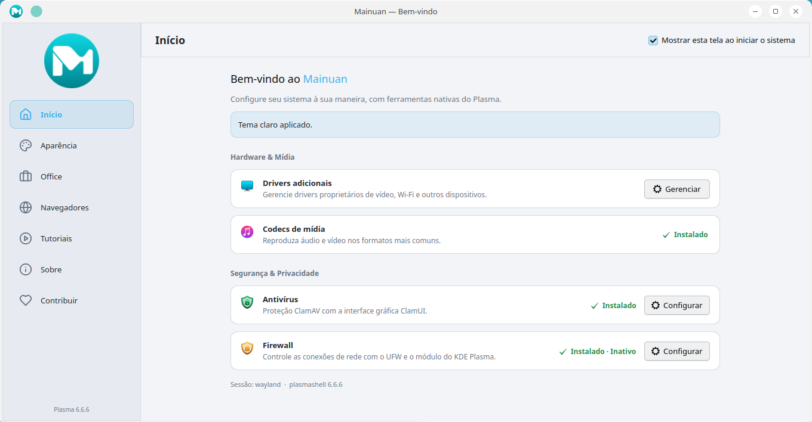
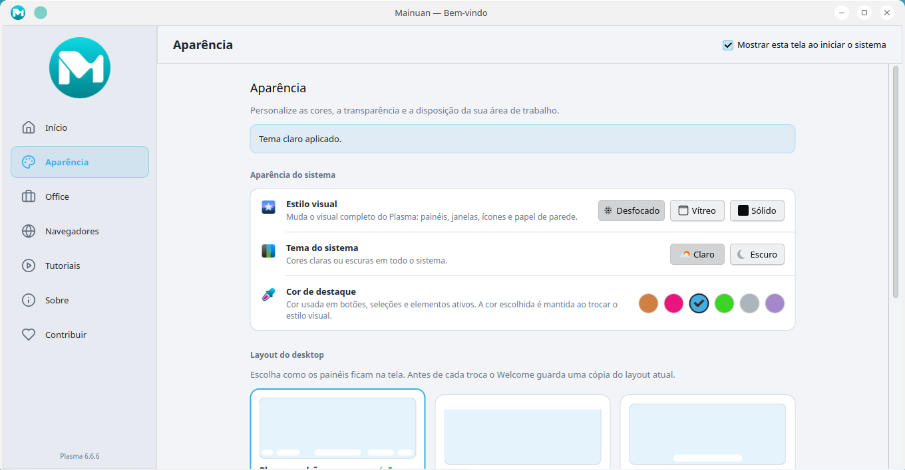
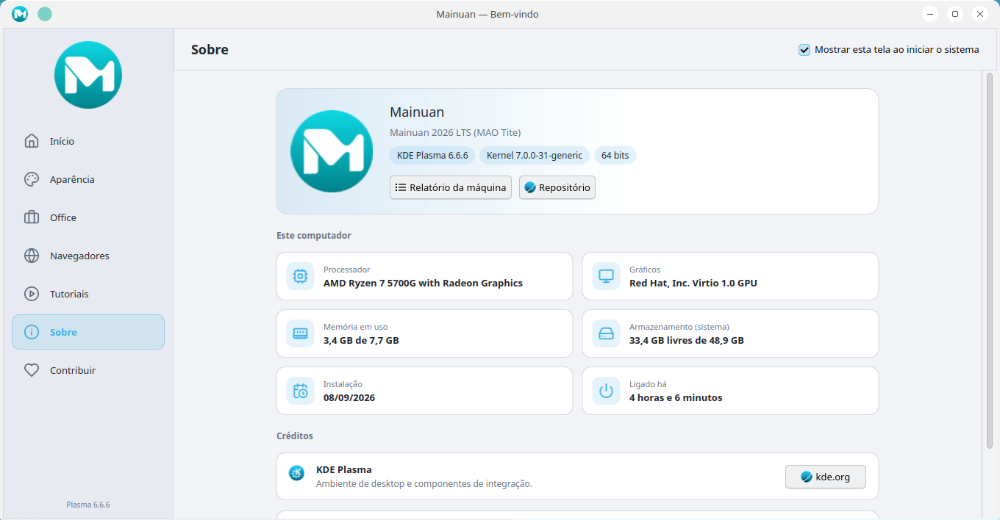
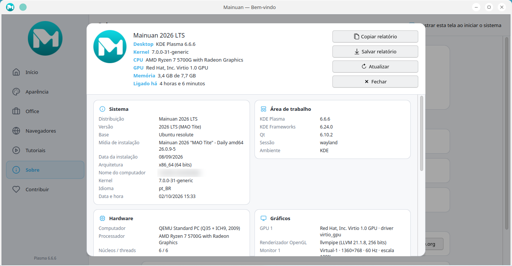
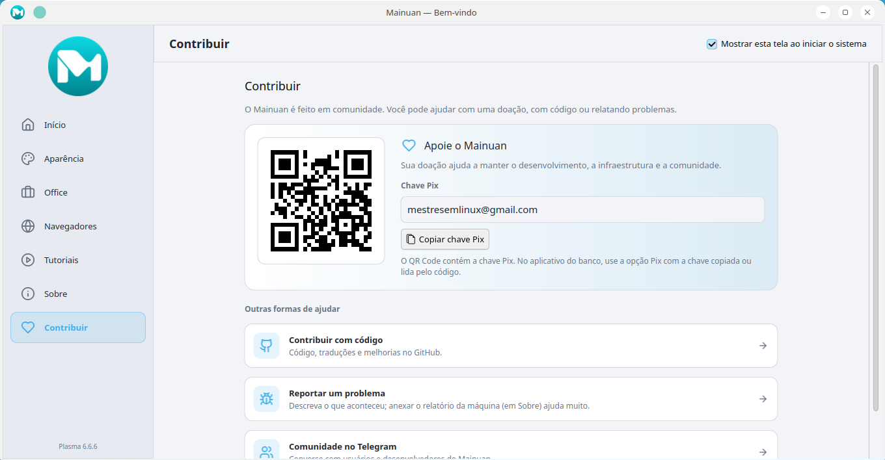
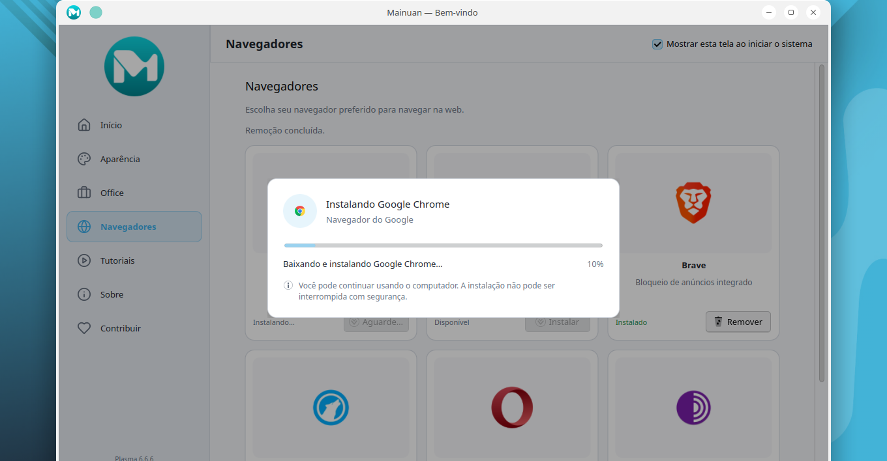
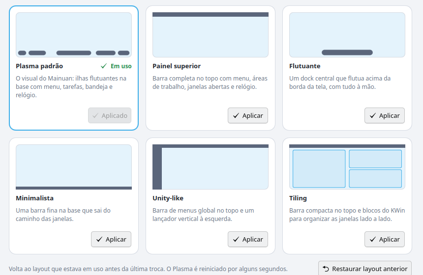
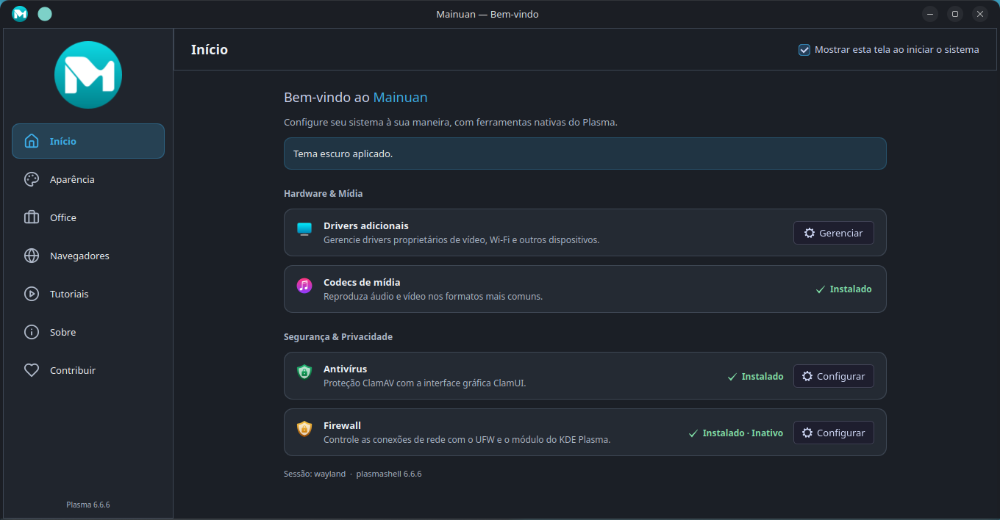

# Mainuan Welcome

Aplicação nativa de boas-vindas do Mainuan para KDE Plasma. A interface é Qt Quick/QML e a integração com o sistema é implementada em C++ seguro, sem Electron, Chromium, Node.js ou WebView.

| Início | Aparência |
|---|---|
|  |  |
| **Sobre** | **Relatório da máquina** |
|  |  |
| **Contribuir** | **Instalador** |
|  |  |
| **Layouts do desktop** | **Tema escuro** |
|  |  |

## Arquitetura

- `src/services/`: estilo visual e cor de destaque (`SystemService`, `VisualStyle`, `AccentProfile`), layouts (`LayoutService`), relatório da máquina (`SystemReportService`), QR Code (`QrCode`), Flatpak, instalador (`InstallService`) e single-instance.
- `src/layouts/`: scripts do Plasma e do KWin dos layouts, embutidos como recurso Qt.
- `src/models/`: modelos tipados para aplicativos, tutoriais e layouts.
- `qml/`: janela Kirigami, páginas e componentes (`PageContainer` limita todas as páginas a 820 px); `qml/icons/`: ícones de linha da navegação (Lucide, licença ISC).
- `rootfs/etc/mainuan/welcome.conf`: configuração do sistema (chave Pix).
- `rootfs/usr/share/welcome/`: apenas assets locais herdados do protótipo.
- `rootfs/usr/libexec/mainuan-welcome/`: helper privilegiado executado via `pkexec`; `rootfs/usr/share/polkit-1/actions/`: ação polkit correspondente.
- `tests/fixtures/`: backends simulados (pkexec, helper, dpkg-query, flatpak) usados pelos testes.
- `docs/`: auditoria, decisões de compatibilidade e resultados de teste.

## Dependências

Build: CMake 3.24+, compilador C++17, Qt 6.5+ (`Core`, `Gui`, `Widgets`, `Qml`, `Quick`, `QuickControls2`, `Network`, `DBus`, `Multimedia`, `Test`), KF6 Config e libqrencode (via pkg-config). No Mainuan/Ubuntu, as dependências exatas estão em `debian/control`.

Runtime: Qt 6, Qt Quick Controls 2 e Dialogs, Kirigami 6 disponível no sistema KDE, `pkexec` (polkit) e um agente de autenticação. `lspci` (pciutils) e `glxinfo` (mesa-utils) são recomendados para o relatório da máquina. A instalação de antivírus, firewall e codecs usa APT e, portanto, requer Debian/Ubuntu; em outros sistemas ela aparece como indisponível. Flatpak, UFW, `kcmshell6` e o gerenciador de drivers são opcionais; a ausência deles é tratada na interface.

## Build e execução

```bash
cmake -S . -B build
cmake --build build -j"$(nproc)"
./build/bin/mainuan-welcome
ctest --test-dir build --output-on-failure
```

`ctest` roda os testes unitários e `smoke_startup`, que abre a interface real fora da tela e falha em qualquer erro de carregamento do QML (pulado sem Kirigami).

Para instalar em um staging root:

```bash
cmake --install build --prefix "$PWD/stage"
```

O pacote instala o binário em `bin/`, o helper em `libexec/mainuan-welcome/`, a ação polkit em `share/polkit-1/actions/` (com o caminho do helper gerado pelo CMake), o desktop file em `share/applications/` e os metadados AppStream em `share/metainfo/`. Os assets são embutidos no recurso Qt para a interface funcionar offline.

## Pacote para o Mainuan

```bash
sudo apt-get install devscripts equivs
sudo mk-build-deps -i -r debian/control
dpkg-buildpackage -us -uc -b
sudo apt-get install ../mainuan-welcome_*_amd64.deb
```

O pacote instala também `/etc/xdg/autostart/org.mainuan.Welcome.desktop`, que abre o Welcome ao entrar na sessão; cada usuário pode desativar isso pela opção “Mostrar esta tela ao iniciar o sistema”.

## Aparência

“Estilo visual” aplica um tema global completo do Mainuan:

| Opção | Tema | Pacote Look-and-Feel (claro / escuro) |
|---|---|---|
| Desfocado | Dream | `Dream-Light-Color-Global-6` / `Dream-Dark-Color-Global-6` |
| Vítreo | Tahoe | `com.github.vinceliuice.MacTahoe-Light` / `-Dark` |
| Sólido | Breeze | `org.kde.breeze.desktop` / `org.kde.breezedark.desktop` |

- **Aplicação:** `plasma-apply-lookandfeel --apply <pacote>` (esquema de cores, tema Plasma, decoração, ícones, cursor). O estilo não escolhe papel de parede: se o tema global trocar o papel de parede, o Welcome reaplica o da cor de destaque. Se o pacote citar ícones ou cursor que não estão instalados (caso do Tahoe), o Welcome usa os do Breeze via `plasma-changeicons`/`plasma-apply-cursortheme`. Tudo roda como o próprio usuário, sem root e sem reiniciar o Plasma.
- **Detecção:** `[KDE] LookAndFeelPackage` em `kdeglobals` e, quando ausente, `[Theme] name` em `plasmarc`, ambos lidos com KConfig pela cascata do KDE (os temas globais gravam em `~/.config/kdedefaults/`). Mudanças feitas fora do Welcome aparecem na hora (`KConfigWatcher`).
- **Tema do sistema** alterna a variante clara/escura do estilo atual; **Cor de destaque** usa `plasma-apply-colorscheme --accent-color`, grava `AccentColor` (que o Plasma mantém ao trocar de estilo) e aplica o papel de parede do Mainuan da cor em todas as telas:

| Cor | Papel de parede (`/usr/share/wallpapers/`) |
|---|---|
| Laranja `#d08040` | `05marrom.png` |
| Rosa `#e8177d` | `03magenta.png` |
| Azul `#3daee9` | `01ciano.png` |
| Verde `#3dd425` | `06lima.png` |
| Cinza `#aab6b9` | `02cinza.png` |
| Lilás `#a588cb` | `04purpura.png` |

- Os ids e arquivos são uma lista fechada em `src/services/VisualStyle.cpp`; o QML só envia `blur`, `glass` ou `solid`.

Diagnóstico: `journalctl --user --since today | grep mainuan.welcome` mostra cada estilo aplicado e detectado, e `kreadconfig6 --file kdeglobals --group KDE --key LookAndFeelPackage` dentro da sessão Plasma.

### Layouts do desktop

Seis layouts nativos do Plasma 6, criados por script do Plasma (`org.kde.PlasmaShell.evaluateScript`) em todas as telas, sem Latte nem Bismuth: **Plasma padrão** (as ilhas flutuantes do Mainuan), **Painel superior**, **Flutuante**, **Minimalista**, **Unity-like** e **Tiling** (barra compacta + blocos nativos do KWin, um grande e dois empilhados). O layout em uso é reconhecido pela marca `MainuanLayout` gravada nos painéis.

Antes de cada troca, `plasma-org.kde.plasma.desktop-appletsrc` e `plasmashellrc` são copiados para `$XDG_DATA_HOME/mainuan-welcome/layout-backups/` (ficam 5 cópias: a primeira, com os painéis que o usuário tinha antes de usar o Welcome, e as mais recentes). Se o layout não for criado corretamente, a cópia é restaurada sozinha; **Restaurar layout anterior** faz o mesmo sob demanda (o Plasma reinicia por alguns segundos). Detalhes em `docs/14-ux-layouts-system-report-validation.md`.

## Sobre e relatório da máquina

A página Sobre mostra o sistema e um resumo deste computador. **Relatório da máquina** reúne sistema, área de trabalho, hardware, gráficos, memória, armazenamento, pacotes, inicialização e rede a partir de `/etc`, `/proc`, `/sys` e, com tempo-limite, `lspci`, `lsblk`, `glxinfo`, `plasmashell` e `dpkg-query`, e pode ser copiado ou salvo como texto. O relatório não contém endereços IP, nomes de rede, números de série nem o nome do computador, e os endereços MAC aparecem mascarados. A data da instalação vem do registro do instalador (`/var/log/installer`); sem ele, a data de criação do sistema de arquivos raiz é mostrada como estimada.

## Página Contribuir (Pix)

A chave Pix vem de `/etc/mainuan/welcome.conf` (`[Contribute] PixKey`, opcionalmente `PixPayload` com um BR Code) e, quando esse arquivo não tem chave, de `~/.config/mainuan/welcome.conf`. O QR Code é gerado localmente com libqrencode; nenhuma API externa é usada.

## Instalador

`InstallService` instala apenas perfis fechados (`antivirus`, `firewall`, `codecs` e `app:<id Flatpak permitido>`). Pacotes Debian são instalados pelo helper via `pkexec`, que recebe somente o nome do perfil; aplicativos vêm do Flathub. O progresso exibido vem do `APT::Status-Fd` e das linhas de progresso do Flatpak. Detalhes em `docs/appearance-and-installer-plan.md`.

Para testar a interface sem alterar o sistema, compile com `-DMAINUAN_DEVELOPER_MODE=ON` e aponte os backends para `tests/fixtures/` com `MAINUAN_DEV_PKEXEC`, `MAINUAN_DEV_HELPER`, `MAINUAN_DEV_DPKG_QUERY`, `MAINUAN_DEV_APT_GET` e `MAINUAN_DEV_FLATPAK` (estado em `MOCK_STATE_DIR`, cenário em `MOCK_SCENARIO`). Builds normais ignoram essas variáveis.

## Compatibilidade

O código usa baseline Qt 6.5 e APIs públicas estáveis. Validado no Mainuan 2026 (Plasma 6.6.6, Qt 6.10, Wayland) e no Plasma 6.7 do ambiente de desenvolvimento. Veja `docs/11-compatibilidade-plasma.md` e `docs/14-ux-layouts-system-report-validation.md`.

## Contribuição

Consulte `docs/` antes de alterar integração de sistema, privilégios ou layouts. Não adicione telemetria, dependências online ou comandos construídos por concatenação.
